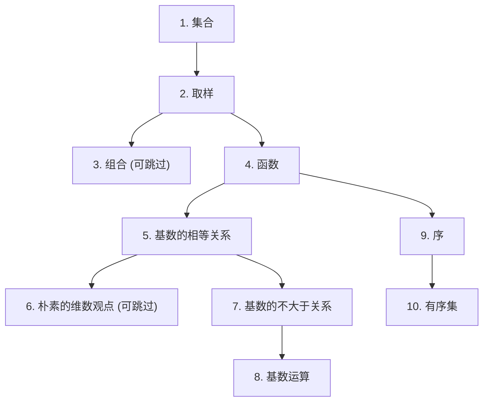

# 朴素集合论

一个数学理论是一个被表达的思维模式.
集合论比较接近语言学, 基于 ZFC 公理化集合论的数学, 是数学领域目前的主流

本书介绍的朴素集合论, 介绍集合论的通用概念, 以便理解 ZFC 等更深入的话题

---

## 石山  讲解

[讲解 - 发行版 - bilibili](https://space.bilibili.com/411282991/lists/8463276)

[讲解 - 预发布版 - douyin](https://www.douyin.com/video/7657174171297859304)

## 石山  笔记

[笔记 - 发行版 - ducia](http://ducia.site/psjhl)

[笔记 - 测试版 - ghPages](https://fleetinglore.github.io/psjhl/)

[笔记 - Github 存储库 - Github](https://github.com/FleetingLore/psjhl)

章节依赖关系如下.
目前只规划到了前十章, 因为我是边学边写的

---

## 本书作者  版权所有

本作品采用 [知识共享 署名 - 非商业性使用 - 相同方式共享 4.0 国际 (CC BY-NC-SA 4.0)](https://creativecommons.org/licenses/by-nc-sa/4.0/deed.zh-hans) 许可协议

- **署名** —— 您必须标明作者 (石山), 并提供许可证的链接
- **非商业性使用** —— 您不得将本作品用于商业目的
- **相同方式共享** —— 如果您对本作品进行改编, 转换或基于本作品进行创作, 您必须基于相同的协议分发您的作品.

## 积极接收意见建议

可以提交 issue 以提供意见建议.

当然, 也可以批评我的写作排版习惯, 但希望能说清楚理由.

---

石山 <Macro__9@outlook.com>

2026 年 7 月 15 日
