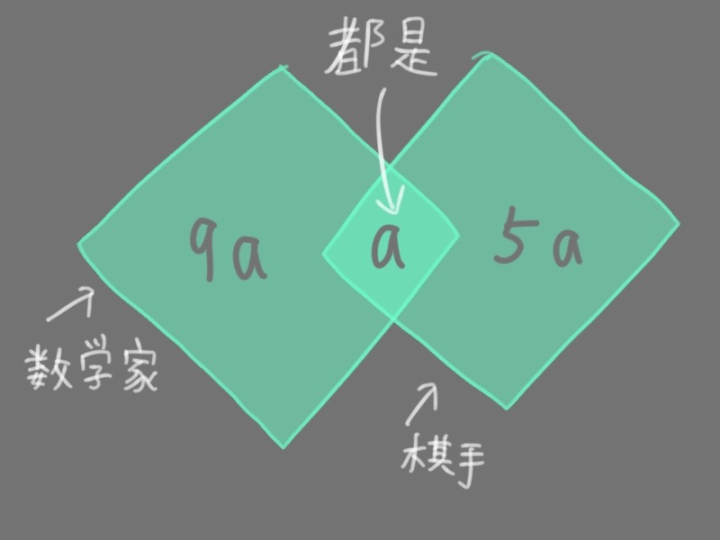
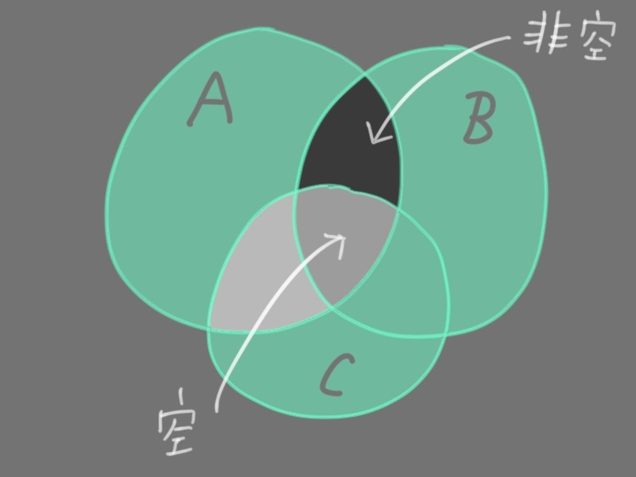
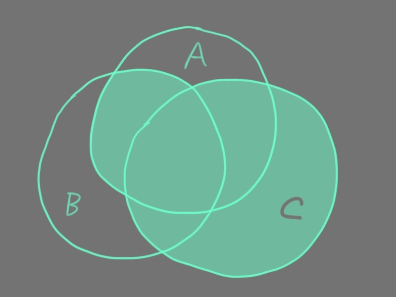
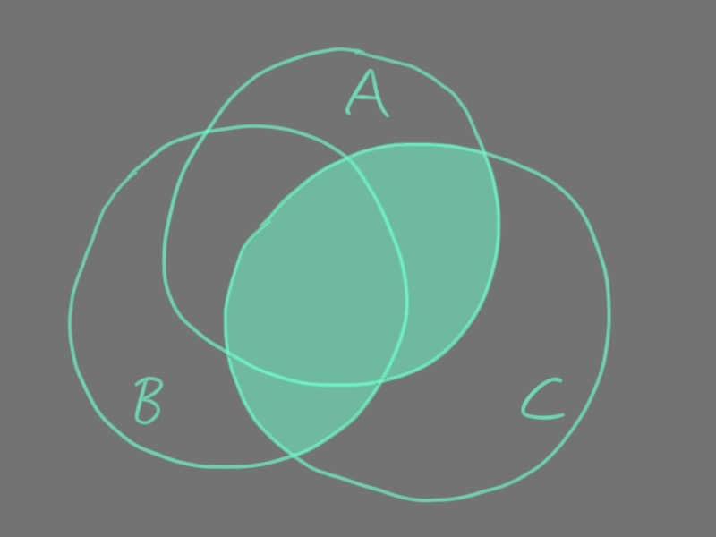
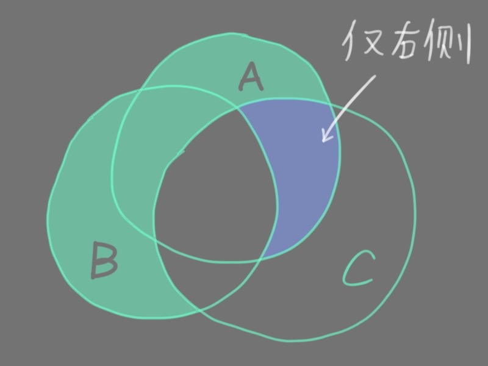
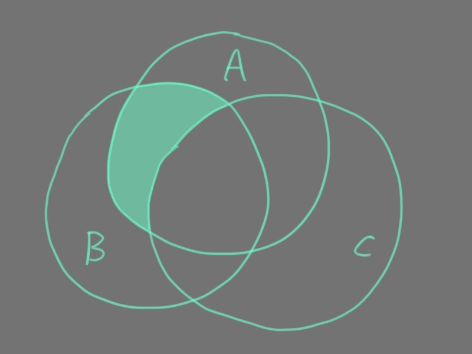
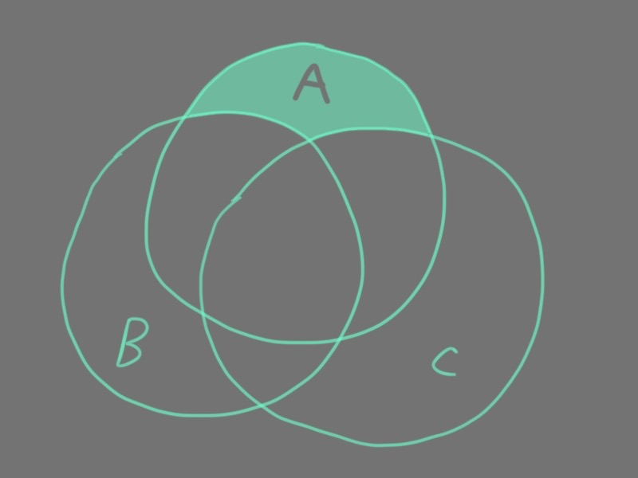
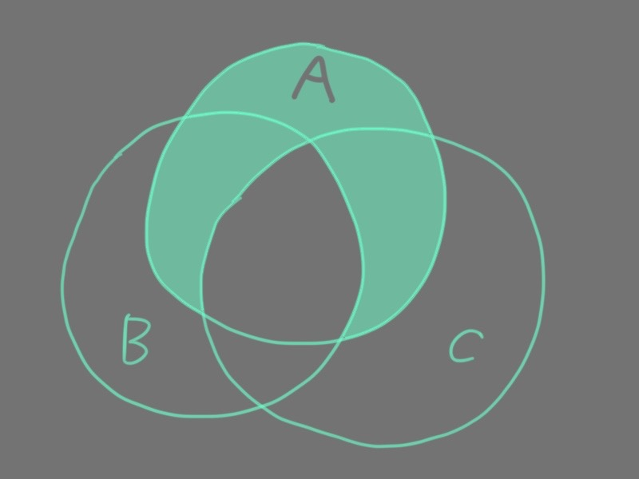
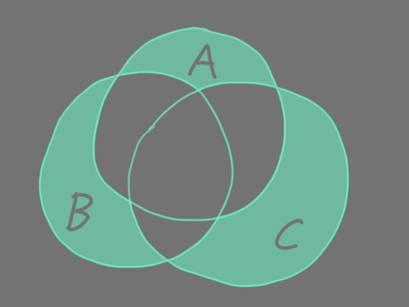

# 1. 集合

## 数集

数字是数集的基本元素

以下是一些例子

$$\mathbb{N} = \{ 0, 1, 2, \cdots \}$$

$$\mathbb{Z} = \{ \cdots, -2, -1, 0, 1, 2, \cdots \}$$

$$\mathbb{Q} = \{ p/q, p \in \mathbb{Z}, q \in \mathbb{Z} \setminus \{ 0 \} \}$$

## 图形

点是图形的基本元素

例如直线有很多点, 平面也有很多点, 而一般不会去说平面是直线的集合

## Venn 图

用图形的形式画出所有可能的交集区域

与欧拉图不同, Venn 图并不是只画出实际存在的交集, 如此更笼统地表达集合的运算律

[解释参考](https://chat.deepseek.com/share/ft7cwyr7sv017pwf49)

## 子集

$A$ 是 $B$ 的子集, 记作 $A \subset B$

> 一些数集的子集关系
>
> $$\mathbb{N} \subset \mathbb{Z} \subset \mathbb{Q}$$
>
> 

## 一些更强的子集关系

### 两集合相等

$A$ 和 $B$ 互为子集

$$A = B \Leftrightarrow A \subset B \wedge B \subset A$$

### 两集合为真子集关系

构成子集关系但不构成相等

$$A \subsetneqq B \Leftrightarrow A \subset B \wedge B \not\subset A$$

### 空集

空集是所有集合的子集

没有元素属于空集

## 从两个集合到一个新的集合的运算

### 交集

记作 $A \cap B$

取两集合的重复元素
 

### 并集

记作 $A \cup B$

两集合的所有元素

### 差集

记作 $A \setminus B$

仅在其中一个集合的元素

### 对称差集

$A \bigtriangleup B$

严格属于一个集合的元素

---
> `问题 1`
>
> 考虑国际象棋手中最老的数学家和数学家中最老的国际象棋手.
> 他们可能是两个不同的人吗?

[解答](https://chat.deepseek.com/share/1fw4ptuc9ee7e7btpf)

---
> `问题 2`
> 
> 对棋手中最好的数学家和数学家中最好的棋手来问同样的问题

`好` 是领域内的限定词, 而 `老` 是对于个体的

[解答](https://chat.deepseek.com/share/19pg2f8xu70wluolk5)

---
> `问题 3`
>
> 十分之一的数学家是棋手而六分之一的棋手是数学家.
> 那一类人 (数学家或棋手) 较多?
> 这两类人人数之比是多少?

参考容斥原理

[解答](https://chat.deepseek.com/share/t43gf5hb4vddm5h58d)

---
> `问题 4`
> 
> 是否存在集 $A$, $B$ 和 $C$, 
> 使得 $A \cap B \neq \varnothing$, $A \cap C = \varnothing$
> 并且 $(A \cap B) \setminus C = \varnothing$ ?

[解答](https://chat.deepseek.com/share/uwfot2btylcj86lctz)

---
> `问题 5`
> 
> 对任意的集合 $A$, $B$, $C$, 下面的 $(a) - (f)$ 哪些是真公式:
> 
> $$(A \cap B) \cup C = (A \cup C) \cap (B \cup C) \tag{a}$$
>
> 
>
> $$(A \cup B) \cap C = (A \cap C) \cup (B \cap C) \tag{b}$$
> 
> 
>
> $$(A \cup B) \setminus C = (A \setminus C) \cup B \tag{c}$$
>
> 
>
> $$(A \cap B) \setminus C = (A \setminus C) \cap B \tag{d}$$
> 
> 
> 
> $$A \setminus (B \cup C) = (A \setminus B) \cap (A \setminus C) \tag{e}$$
>
> 
>
> $$A \setminus (B \cap C) = (A \setminus B) \cup (A \setminus C) \tag{e}$$
>
> 

[解答](https://chat.deepseek.com/share/cscm07a44qriwwpw3n)

---
> `问题 6`
>
> 对前述问题的真公式, 从定义开始给出形式证明
> 
> 即另 $x$ 是一方的元素, 则也是另一方的元素.
> 然后再倒过来证, 体现子集关系是两边的, 从而是等价的

[解答](https://chat.deepseek.com/share/65lgu1kbc079vjhpgc)

---
> `问题 7`
>
> 证明对称差运算是结合的:
> 
> $$A \bigtriangleup (B \bigtriangleup C) = (A \bigtriangleup B) \bigtriangleup C$$
> 
> 对任意的 $A$, $B$, $C$ 都对.
> 
> 

这涉及到一个叫特征函数的话题, 会在稍后表述.
实质上是用数字的代数运算律表示集合运算律

但对于这个题, 同样可以用 `问题 6` 那样的形式演算

[解答](https://chat.deepseek.com/share/k5m6wdhny7o2k5a4nh)

---
> `问题 8`
> 
> 证明 $(A _1 \cap \cdots \cap A _n) \bigtriangleup (B _1 \cap \cdots B _n) \subset (A _1 \bigtriangleup B _1) \cup \cdots \cup (A _n \bigtriangleup B _n)$ 对任意集合 $A _1$, $\cdots$, $A _n$ 和 $B _1$, $\cdots$, $B _n$ 都成立

[解答](https://chat.deepseek.com/share/11wmf9pmnj4zdy8iow)

---
> `问题 9`
> 
> 考虑含有集合变元和运算 $\cap$, $\cup$, $\setminus$ 的左边与右边相等的式子.
> 证明如果对于某些集这个等式为假, 那么它对于至多包含一个元素的某些集也为假

[解答](https://chat.deepseek.com/share/t8eb228ehoiz4ryxhg)

---
> `问题 10`
> 
> 由集合变元 $A$ 与 $B$, 应用并、交、差可以得到多少个不同的表达式?
> 变元和运算可以运用多次.
> 若两个表达式对于所含集合变元的每个值它们都有相同的值, 则这两个表达式就被看作是相同的.
> 对三个集合和 $n$ 个集合求解同样的问题

[解答](https://chat.deepseek.com/share/5cv1iy641oteuxt8o9)

---
> `问题 11`
> 
> 如果只允许使用 $\cup$ 和 $\cap$, 求同一问题的解

[解答](https://chat.deepseek.com/share/vilgml3r3ankll7386)

[戴德金数](https://mathworld.net.cn/DedekindNumber.html)

---
> `问题 12`
> 
> 一个 $n$ 元集有多少个子集?

[解答](https://chat.deepseek.com/share/zz43psq23d4vcw2680)

这结论是显然的, 但在本章还会用到

---
> `问题 13`
> 
> 设 $A$ 有 $n$ 个元素, 而 $B \subset A$ 有 $k$ 个元素, 试求使得 $B \subset C \subset A$ 的不同的集 $C$ 的个数

[解答](https://chat.deepseek.com/share/9v8mw16pgfjtzsdbry)

---
> `问题 14`
> 
> 集 $U$ 有 $2 n$ 个元素.
> 选取 $A$ 的 $k$ 个子集, 它们中没有一个是另一个的子集.
> $k$ 的最大值是多少?

[解答](https://chat.deepseek.com/share/mgpo3d3sjpxqq4ge13)
