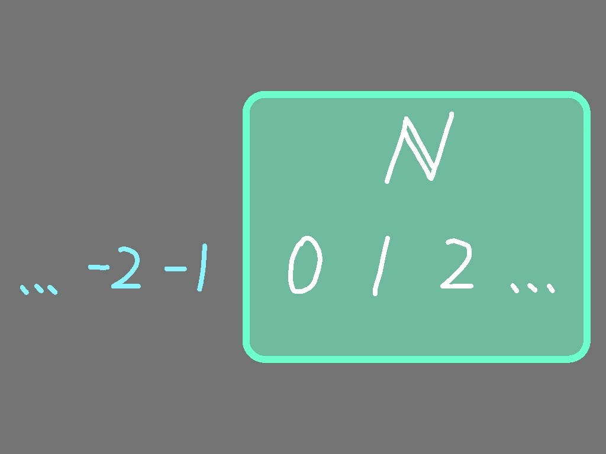
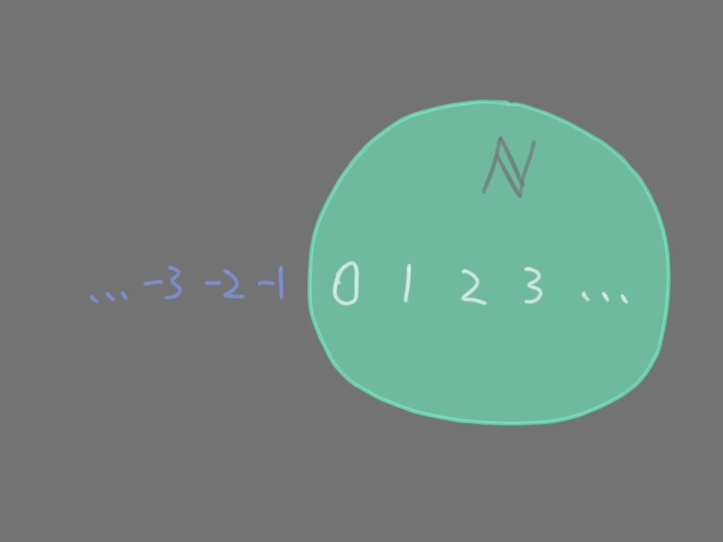
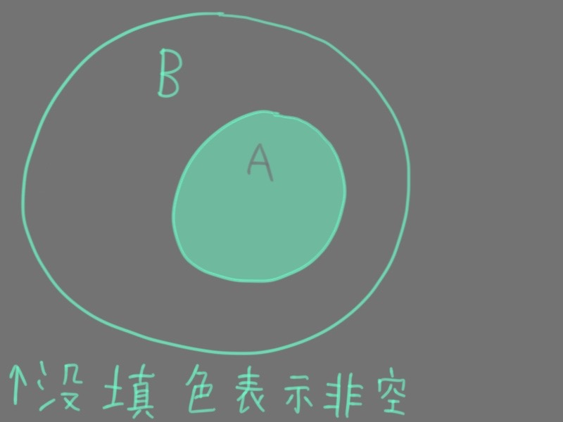
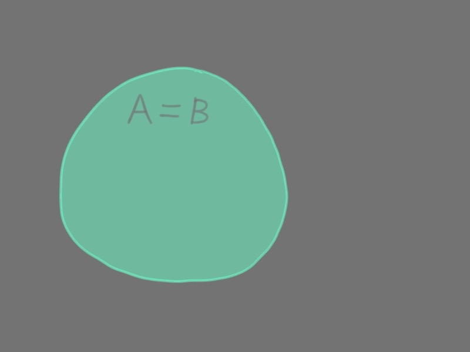
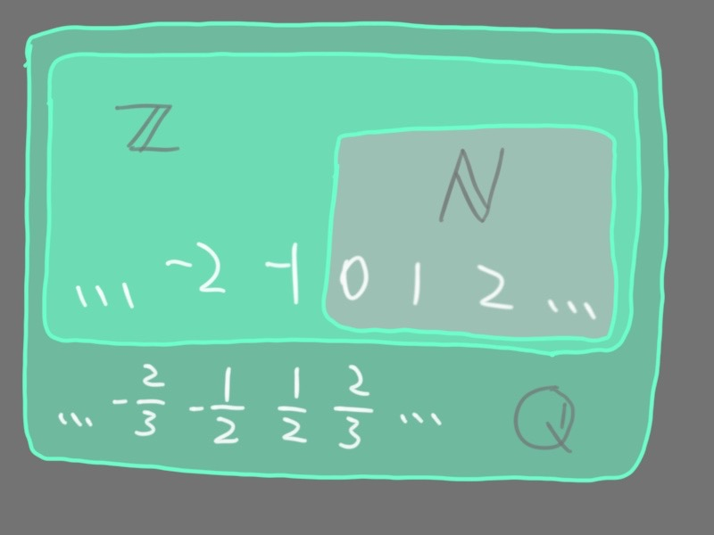
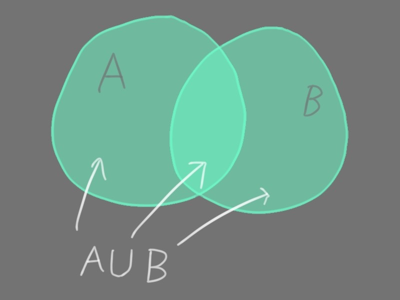
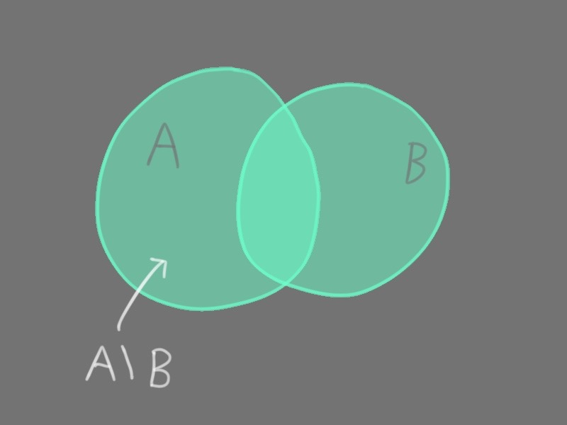
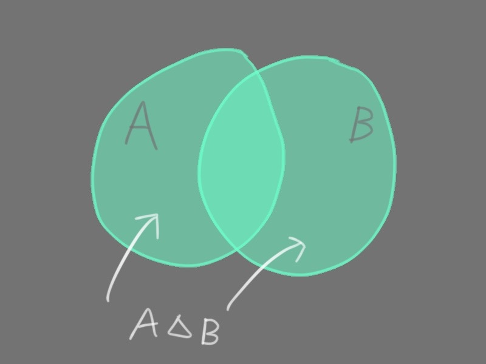

# 1. 集合

## 数集

数字是数集的基本元素

以下是一些例子

$$\mathbb{N} = \{ 0, 1, 2, \cdots \}$$

$$\mathbb{Z} = \{ \cdots, -2, -1, 0, 1, 2, \cdots \}$$

$$\mathbb{Q} = \{ p/q, p \in \mathbb{Z}, q \in \mathbb{Z} \setminus \{ 0 \} \}$$

## 图形

点是图形的基本元素

例如直线有很多点, 平面也有很多点.
一般不会去说平面是直线的集合

## Venn 图

用图形的形式画出所有可能的交集区域

与欧拉图不同, Venn 图并不是只画出实际存在的交集, 如此更笼统地表达集合的运算律

[更多的解释](https://chat.deepseek.com/share/ft7cwyr7sv017pwf49)

## 子集

$A$ 是 $B$ 的子集, 记作 $A \subset B$

> 一些数集的子集关系
>
> $$\mathbb{N} \subset \mathbb{Z} \subset \mathbb{Q}$$
>
> 

## 一些更强的子集关系

### 两集合相等

$A$ 和 $B$ 互为子集

$$A = B \Leftrightarrow A \subset B \wedge B \subset A$$

### 两集合为真子集关系

构成子集关系但不构成相等

$$A \subsetneqq B \Leftrightarrow A \subset B \wedge B \not\subset A$$

### 空集

空集是所有集合的子集

没有元素属于空集

## 从两个集合到一个新的集合的运算

### 交集

记作 $A \cap B$

取两集合的重复元素
 

### 并集

记作 $A \cup B$

两集合的所有元素

### 差集

记作 $A \setminus B$

仅在其中一个集合的元素

### 对称差集

$A \bigtriangleup B$

严格属于一个集合的元素

## 特征函数
