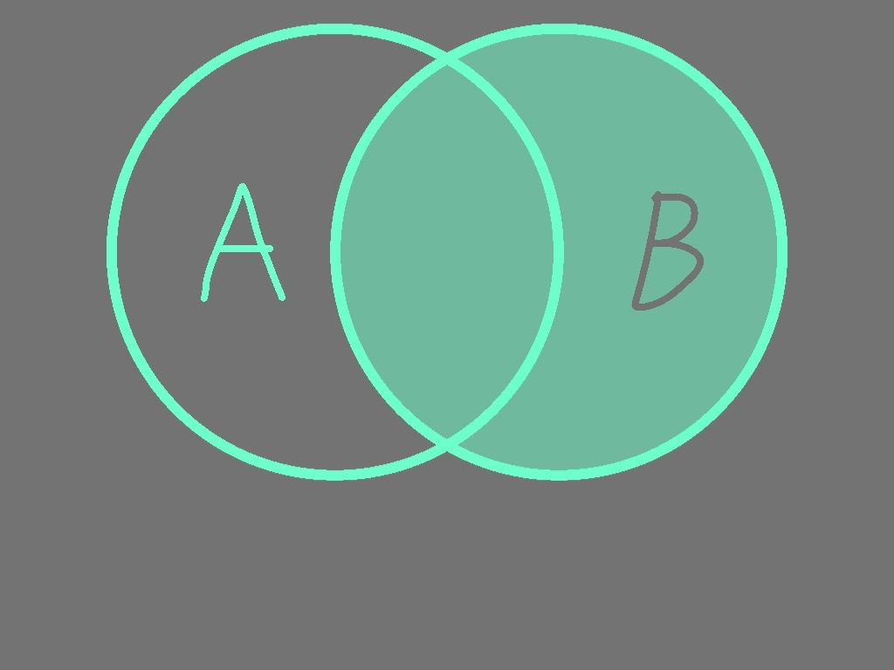
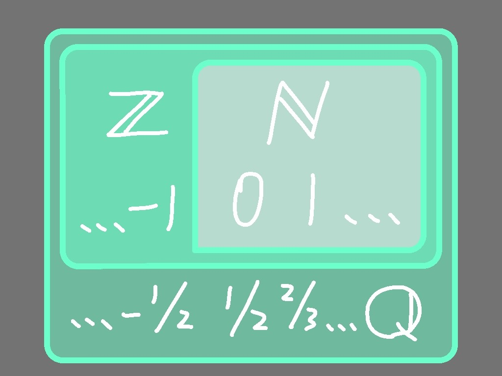
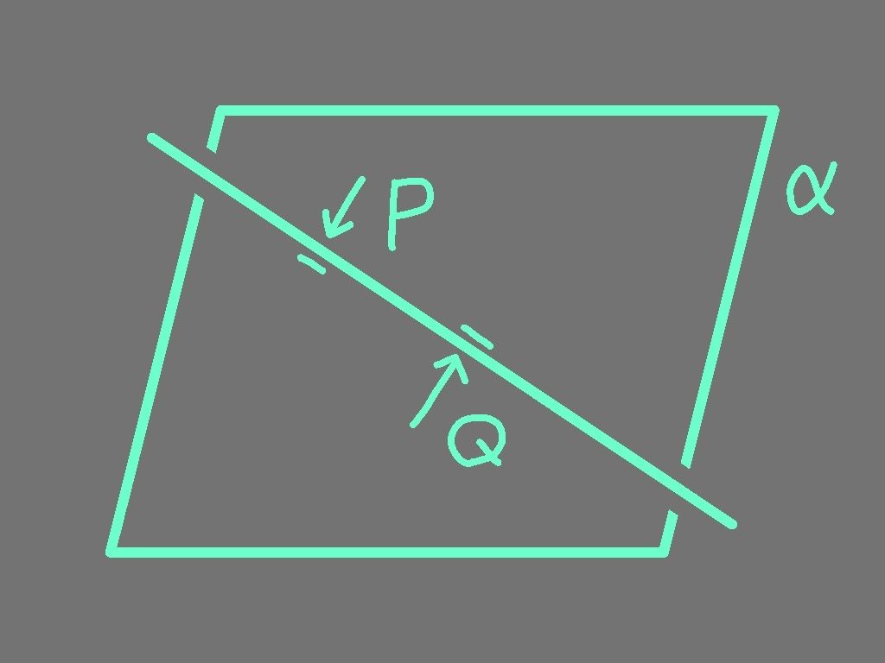
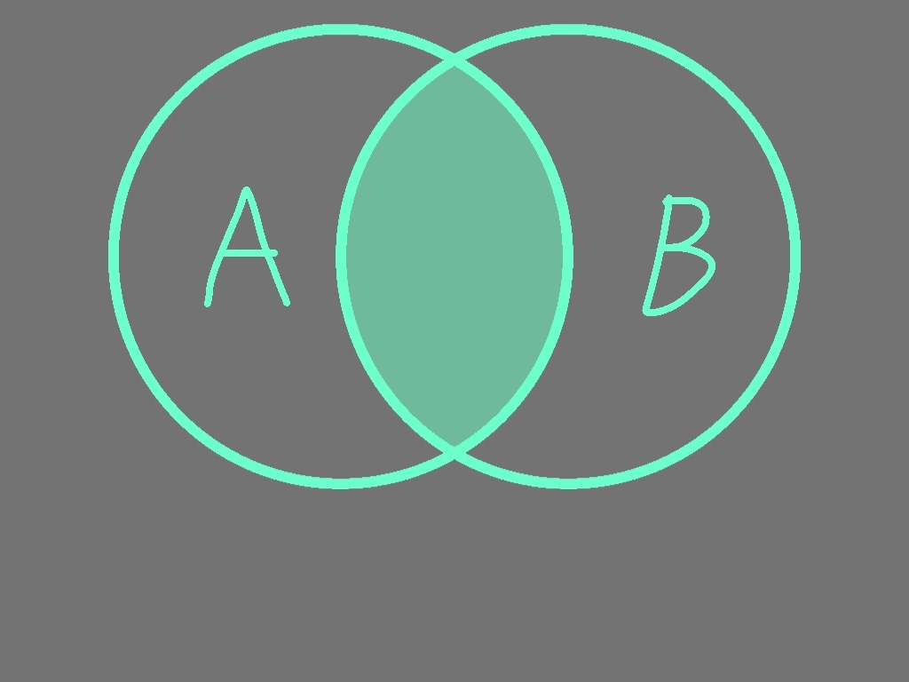
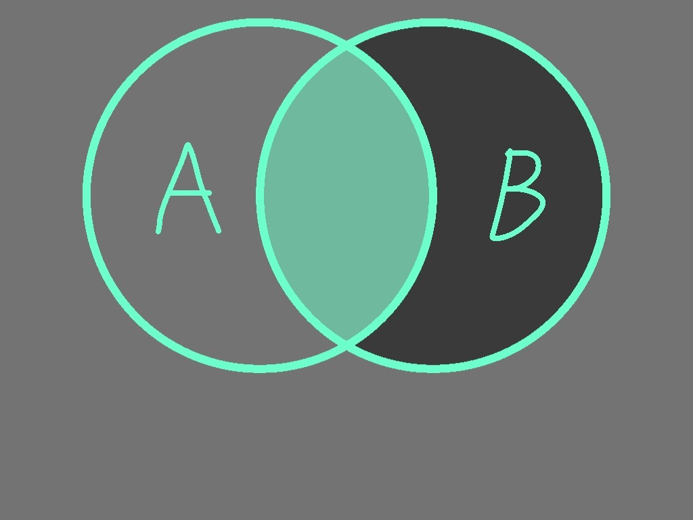

# 1.2  子集关系

<!-- 在网课讲解中, 提及形式定义, 但也不去深入解释 -->

$A$ 是 $B$ 的子集, 记作 $A \subset B$

## 一些数集的子集关系

$$\mathbb{N} \subset \mathbb{Z} \subset \mathbb{Q}$$

## 一些图形的子集关系

$$点 P \in 面 \alpha, 点 Q \in 平面 \alpha \implies 线 PQ \subset 面 \alpha$$

## 两集合相等

$A$ 和 $B$ 互为子集

$$A = B \Leftrightarrow A \subset B \wedge B \subset A$$

## 两集合为真子集关系

构成子集关系但不构成相等

$$A \subsetneqq B \Leftrightarrow A \subset B \wedge B \not\subset A$$

## 空集

<!-- 在网课讲解中, 简单提及一下怎么互相推导 -->

空集是所有集合的子集

没有元素属于空集

> 可以想一下这两个表述有什么关系
>
> `提示` 如果空集不是 A 的子集, 那就会有一个元素属于空集但不属于 A.

[参考](https://chat.deepseek.com/share/1m9nminmd6i9iemho7)
