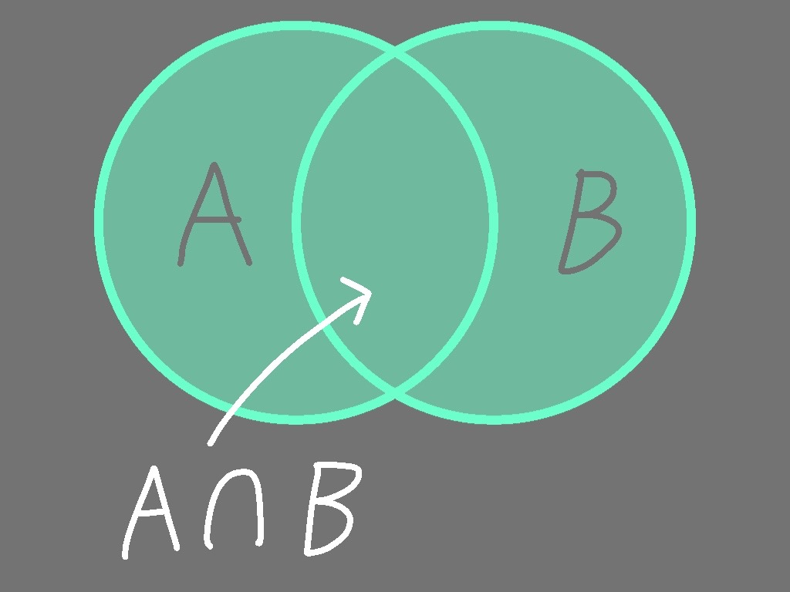
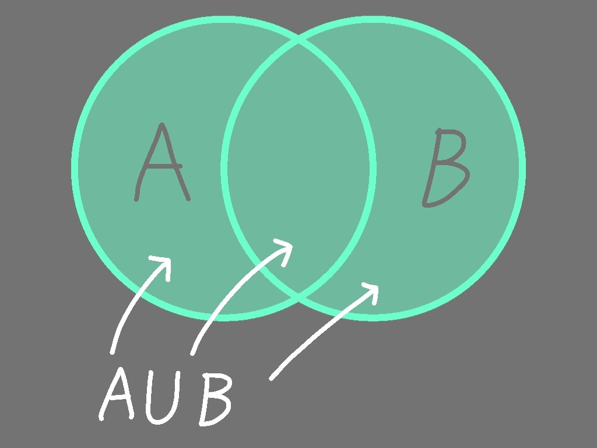
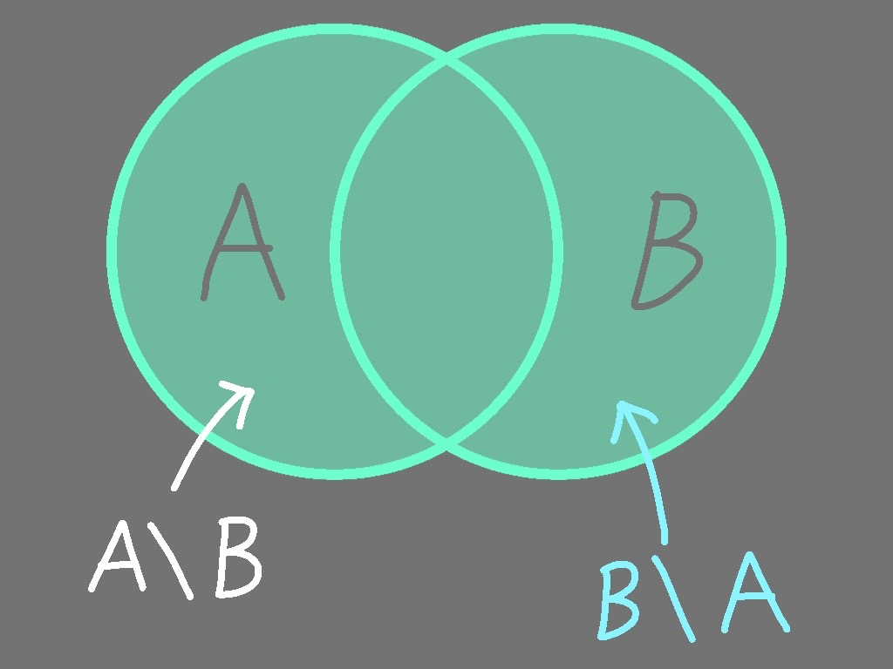
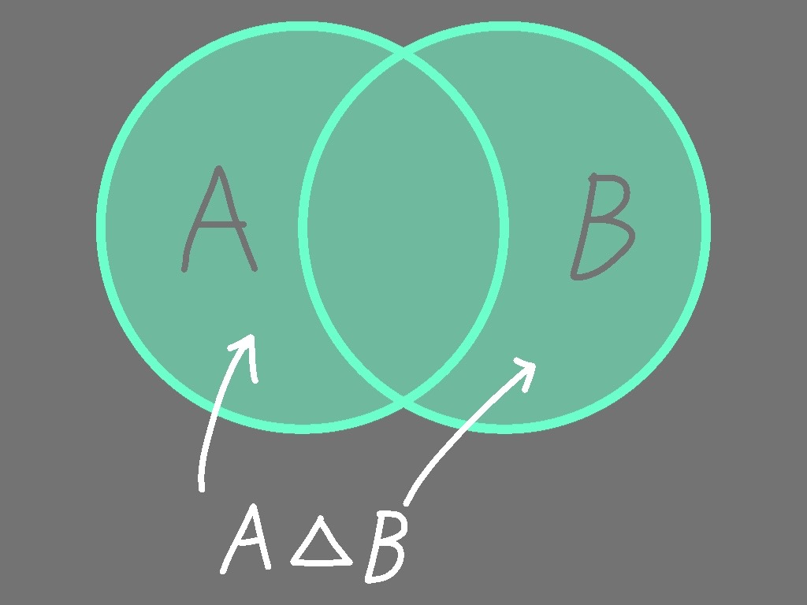

# 1.3  二元运算

<!-- 在网课讲解中, 提及形式定义, 但也不去深入解释 -->

<!-- 在网课讲解中, 以 A = {1, 2, 3}, B = {2, 3, 4, 5} 举例 -->

## 交集

记作 $A \cap B$

取两集合的重复元素 

## 并集

记作 $A \cup B$

两集合的所有元素

## 差集

记作 $A \setminus B$

仅在前者的元素

注意, $A \setminus B$ 和 $B \setminus A$ 一般是不同的集合

## 补集

如果 $B \subset A$, 也可以称 $A \setminus B$ 为 $B$ 在 $A$ 的补集

[朴素集合论下没有绝对全集](https://chat.deepseek.com/share/zz47emdl2elwmh59sq)
为此, 补集总是相对某个集合而言的

## 对称差集

$A \bigtriangleup B$

仅仅属于两者中某一个集合的元素

用已经定义过的交, 并, 差运算, 也能把对称差集表示出来.

$$
\begin{aligned}
A \bigtriangleup B
& = (A \setminus B) \cup (B \setminus A) \\
& = (A \cup B) \setminus (A \cap B)  \\
\end{aligned}
$$

显然, 也能用对称差和一些别的运算, 表示另一些别的运算, 例如

$$A \cap B = (A \cup B) \setminus (A \bigtriangleup B)$$

> $A \setminus B$ 的结果能用另外三种运算表示么?

[参考](https://chat.deepseek.com/share/fprez99nf770yqzxbh)
